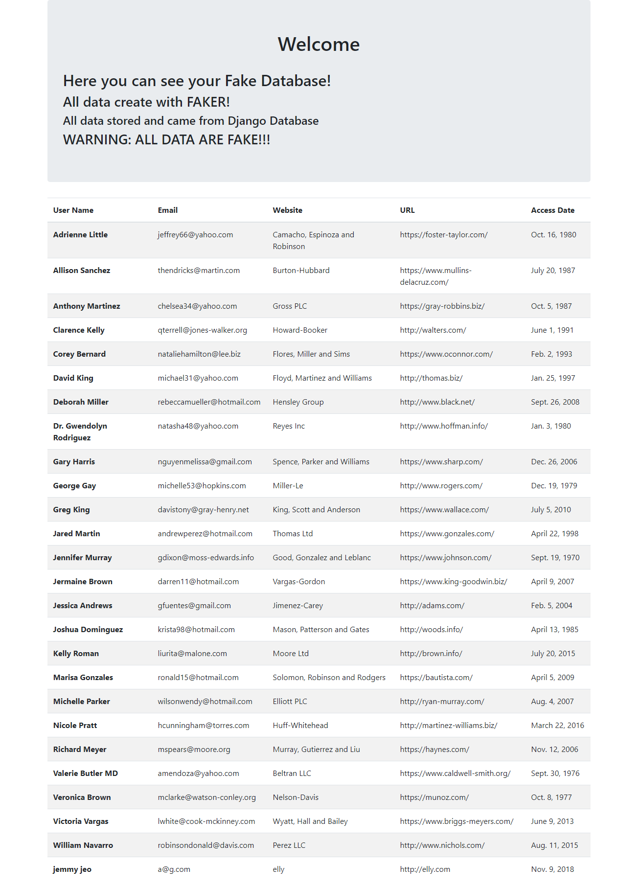

# Django_Faker
### i'm try showing that, how you can use FAKER library on Django. On this project i use faker to create a fully fake database and store the data on Django database. After that i call those data and show them a html page using Django template tagging way. Also i use BootStrap4. i try to code it clean and useable for other developer, Thanks

## Here is an Exmaple From HTML Screen-Shot 
##### WARNING !!! ALL DATA FAKE !!!

